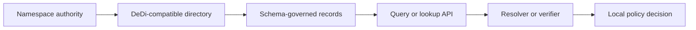
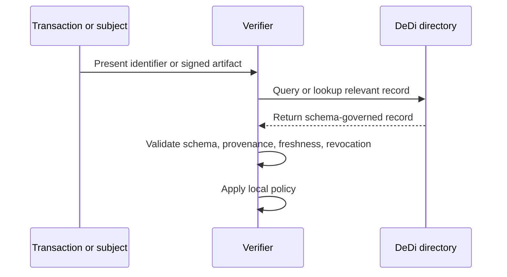

# DeDi architecture and protocol model

This document explains DeDi in implementation terms rather than presentation terms.

## The problem DeDi addresses

Many verification workflows depend on public information that exists outside the signed object being checked. A verifier may need to know:

- what public key is current,
- whether an entity is still authorized,
- whether a credential or participant has been revoked,
- or which registry is authoritative for a given namespace.

These checks are often performed through fragmented, registry-specific interfaces. That creates integration cost, inconsistent trust logic, and operational drag.

DeDi introduces a common way to expose and consume this public state.

## System view

## Core model

### 1. Namespace

A namespace is the trust-discovery anchor. It helps answer: _which organization or authority is responsible for this directory?_ In many deployments, the namespace will align with a domain or institution.

### 2. Directory

A directory is an addressable collection of records governed by a schema. A directory should have a clear purpose, such as:

- public key lookup,
- membership status,
- revocation list,
- participant discovery.

### 3. Record

A record is the individual unit retrieved by a client. It should be:

- semantically well-defined,
- current,
- and attributable to an authoritative source.

## Trust model

DeDi does not create trust out of nothing. It makes trust dependencies more explicit and easier to integrate.

A relying party still needs to decide:

- which namespaces it trusts,
- which directories are authoritative,
- how freshness is evaluated,
- and how returned records influence an accept, reject, or escalate decision.

## Protocol role in a verification flow

## Architectural properties that matter

For a DeDi-compatible directory to be useful in production, the implementation should prioritize:

- **authoritativeness**: clear ownership and publication responsibility,
- **freshness**: records should reflect current state,
- **availability**: lookup must be operationally dependable,
- **stability**: field semantics should not drift unexpectedly,
- **traceability**: provenance and change history should be discoverable where possible.

## Relationship to existing systems

DeDi is best understood as a compatibility and exposure layer.

It can sit in front of:

- existing public registries,
- registry-backed trust networks,
- ecosystem participant lists,
- PKI-adjacent key directories,
- and application-specific public state stores.

That means adoption does not require a greenfield system. A team can wrap an existing registry with DeDi-compatible interfaces and schemas.

## Implementation posture

There are two common roles:

### Publisher or registry operator
Publishes authoritative records through a stable, machine-readable interface.

### Consumer or verifier or integrator
Retrieves records and uses them in decision flows.

Projects often play both roles.

## Design implications

A DeDi implementation becomes more useful when it includes:

- explicit discovery conventions,
- clear schema-to-use-case mapping,
- examples for every record type,
- response validation,
- and versioning discipline.

These are not side concerns. They are the difference between an interesting concept and an adoptable protocol.
