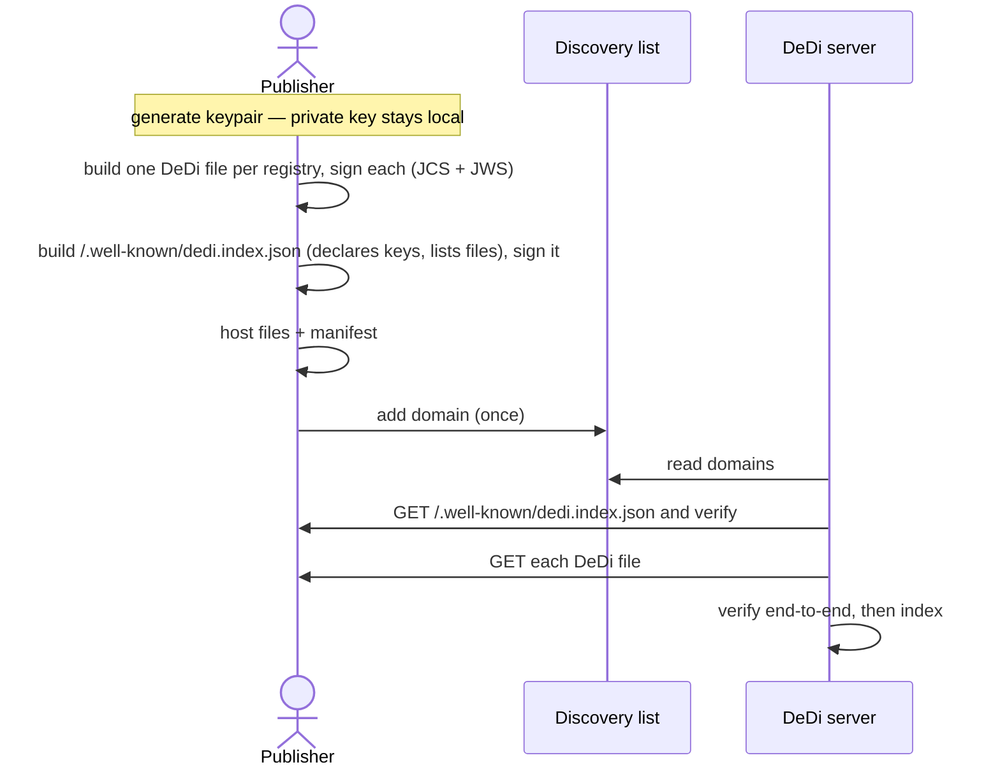
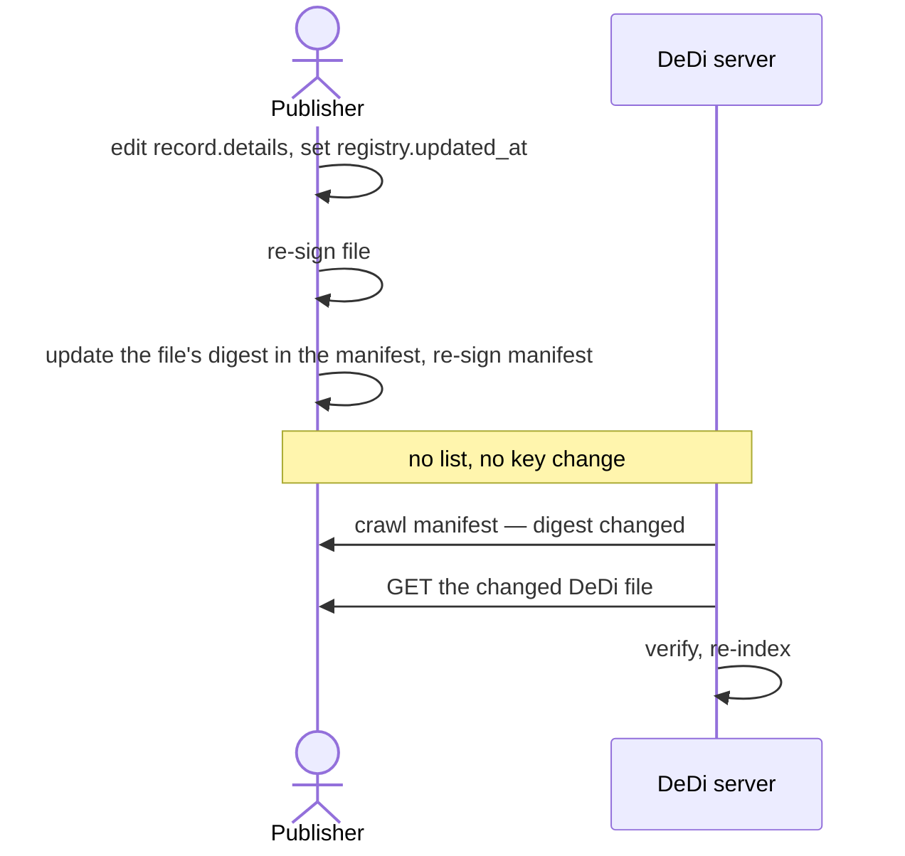
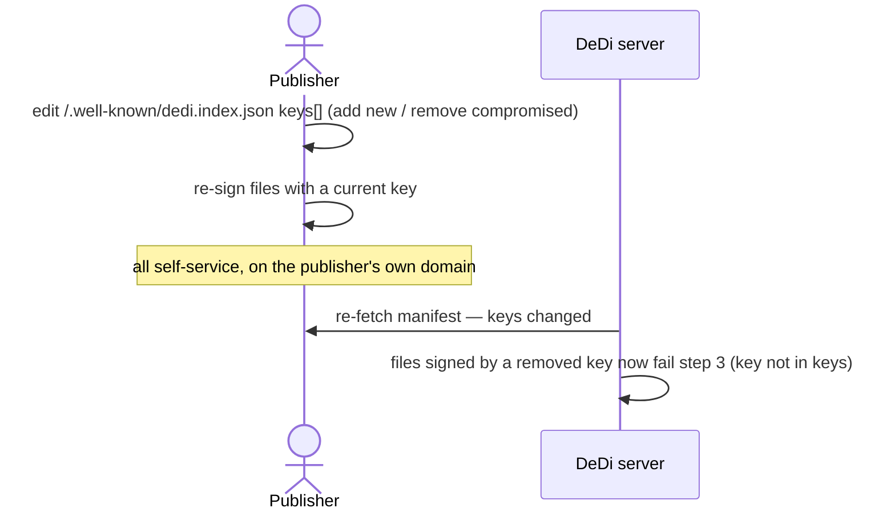
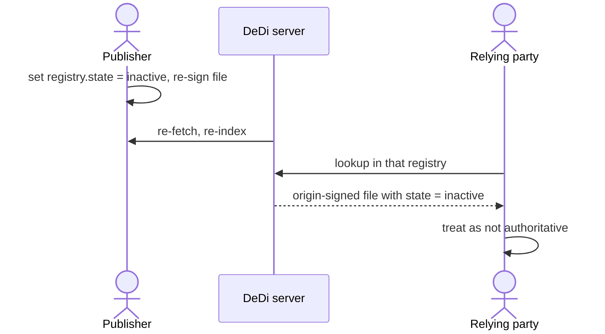
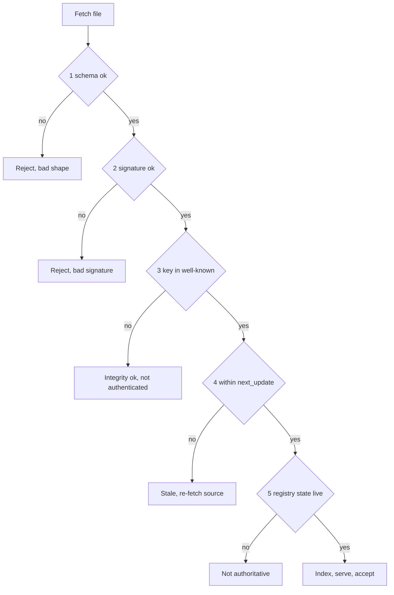
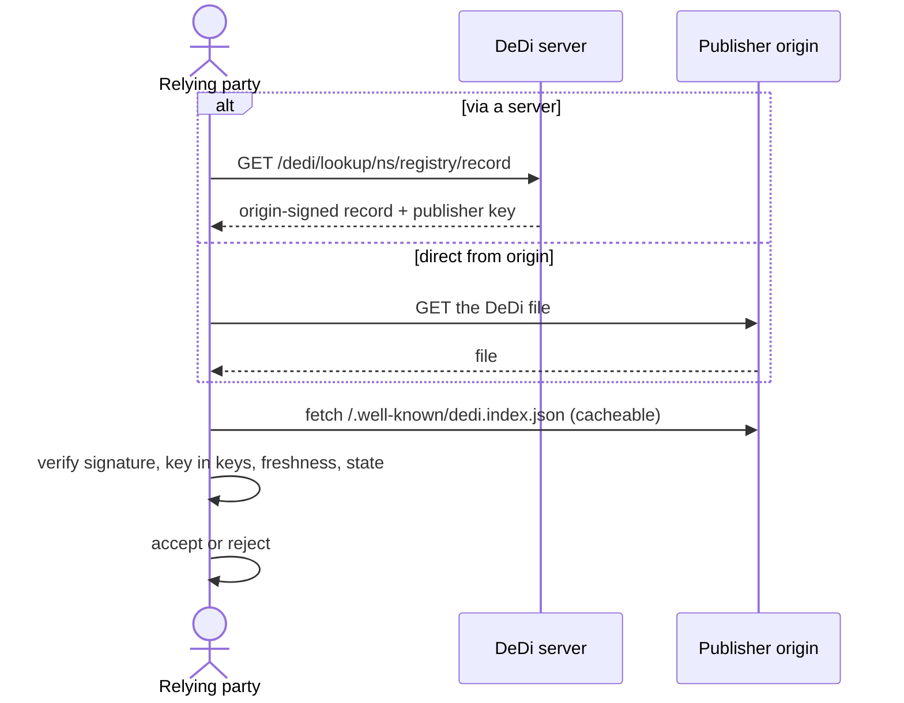

# Publishing DeDi Files

*Origin-hosted, server-optional directories*

Status: **Draft** · Target: `docs/publishing-dedi-files.md` in the DeDi Protocol repo

---

## 1. Introduction

### 1.1 Background

DeDi protocol is an open protocol for publishing public directories: registries of public information such as
public key directories, revocation and sanctions lists, membership rolls, professional registers, and
company or bank directories. Each such directory is conventionally exposed through a bespoke
interface, obliging every relying party to integrate with each source independently. DeDi defines a
unified machine-readable convention for these directories, so that a relying party may discover a
directory it has not previously encountered and evaluate its contents against the three pillars of
trust: integrity (the data has not been modified since issuance), validity (the data is current and
has not been revoked), and authenticity (the data originates from the source it names).

This document does not alter the DeDi information model, which remains Namespace → Registry
(Directory) → Record.

### 1.2 Adopting DeDi

**A publisher adopts DeDi by publishing signed DeDi files.** No further requirement applies. The
publisher produces one self-contained, signed DeDi file per registry and serves a signed
`/.well-known/dedi.index.json` manifest declaring its signing key or keys. Operation of a service is
not required at any point.

A publisher MAY host its files at any location under its control, including its own web server, a
source repository, or a public file-sharing service. A publisher MAY instead deposit its files with a
DeDi server that hosts them on its behalf. The choice of host does not affect verification: a verifier
evaluates the publisher's signature against the key declared in the publisher's manifest, irrespective
of which party serves the bytes. Hosting is therefore a deployment concern and carries no
weight in the trust model.

### 1.3 DeDi servers

A DeDi server is a distinct role and is not a mode of publisher conformance. It is optional
infrastructure, operated by any party that wishes to serve published files at scale. A server
discovers and verifies DeDi files, indexes them, and exposes the DeDi API — `/dedi/lookup` and
`/dedi/query` — across many publishers. A server MAY additionally offer capabilities that static files
do not provide, such as cross-directory search, version history, conditional fetch, and availability
guarantees.

| | Publisher | DeDi server |
|---|---|---|
| Produces | DeDi files and a signed manifest | an index and the DeDi APIs |
| Endpoints exposed | none; static files | `/dedi/lookup`, `/dedi/query` |
| Signs data | required | relays the publisher's signature |
| Operates infrastructure | no | yes |

A relying party obtains an equivalent guarantee whether it queries a server or retrieves a file directly
from the publisher's host.

### 1.4 Scope

This document specifies the publication model: the DeDi file format, the manifest,
signing and verification, and discovery. It is additive with respect to the existing
protocol and introduces no change to the information model, to the DeDi API, or to the behaviour of
existing servers. A publisher that already serves the DeDi API directly remains conformant and need
take no action.

---

## 2. Terminology

- **Publisher** — owns the data, produces DeDi files. Identified by a domain it controls.
- **DeDi file** — a self-contained, signed JSON document: one registry (directory) and its records.
- **Manifest** — `/.well-known/dedi.index.json`, a signed document declaring the publisher's current signing
  key(s) and listing its DeDi files.
- **DeDi server** — ingests DeDi files, verifies them, indexes them, serves the DeDi APIs.
- **Discovery list** — a public list of publisher domains (and references to further lists), so servers know who exists.

The DeDi information model is unchanged: **Namespace → Registry → Record.** A DeDi file is a signed,
transport-independent projection of one Registry and its Records.

---

## 3. Roles and the end-to-end flow

```
   PUBLISHER (example.org)
     │  produces + signs two things:  DeDi files   and   /.well-known/dedi.index.json (declares its keys)
     │  hosts both anywhere it controls;  puts its domain on a public discovery list
     ▼
   DEDI SERVER    ── finds publishers via the discovery list + crawl
     │  ingests each file, verifies it, indexes, serves /dedi/lookup · /dedi/query
     ▼
   RELYING PARTY
     verify the file's own signature  →  confirm its key ∈ the publisher's well-known  →  trust
     (may query a server, or fetch the DeDi file straight from the publisher — same check either way)
```

---

## 4. The three artifacts

| Artifact | Where | Job |
|---|---|---|
| **DeDi file** | anywhere the publisher controls | one signed registry + its records |
| **Manifest** `/.well-known/dedi.index.json` | the publisher's domain | declares current key(s); lists files |
| **Discovery list** | a public list (e.g. a GitHub repo) | names publisher domains so DeDi servers find them |

The trust model depends only on the first two, both of which are signed.

---

## 5. The DeDi file

A DeDi file carries **exactly one registry** (directory). A namespace with *N* registries publishes
*N* files, indexed together by the manifest. Fields reuse the DeDi API's names so a server projects a
file into a `/dedi/lookup` response without translation. A DeDi file is served as its own document,
or — for a small registry — embedded verbatim in the manifest's `files[]` (see 6.4).

```jsonc
{
  "dedi_version": "0.1",
  "type": "dedi-file",                        // required — the only self-identification that survives relocation
  "source_url": "https://example.org/dedi/dedi.public-keys.json",  // where to re-fetch a fresher copy after relocation
  "next_update": "2026-07-15T10:00:00Z",      // stale after this → re-fetch source_url

  "publisher": {
    "domain": "example.org",                  // its well-known MUST list the key below
    "key": {                                  // PUBLIC key only, RFC 7517 JWK. Embedded → offline integrity.
      "kid": "key-1", "kty": "OKP", "crv": "Ed25519",
      "x": "11qYAYKxCrfVS_7TyWQHOg7hcvPapiMlrwIaaPcHURo"
    }
  },

  "namespace": "example.org",                 // → {namespace} in /dedi/lookup (usually the domain)
  "registry": {
    "name": "public-keys",                    // → {registry_name}
    "schema": "https://raw.githubusercontent.com/LF-Decentralized-Trust-labs/decentralized-directory-protocol/main/schemas/Public_key.json",
    "state": "live",                          // live | inactive
    "updated_at": "2026-07-08T10:00:00Z",     // content last changed, not merely re-issued
    "description": "Current signing keys for example.org services",  // optional
    "meta": { "display_name": "Example Org signing keys" }           // optional free-form metadata
  },

  "records": [                                // pure list entries — a name + schema-conformant data
    {
      "record_name": "auth-service",          // → {record_name}
      "details": {
        "public_key_id": "example.org:auth",
        "publicKey": "MCowBQYDK2VwAyEAGb9ECWmEzf6FQbrBZ9w7lshQhqowtrbLDFw4rXAxZk",
        "keyType": "ed25519",
        "keyFormat": "base64",
        "entity": { "name": "Auth Service", "url": "https://example.org/auth" }
      }
    }
  ],

  "proof": {                                  // detached JWS over JCS(document − proof), by publisher.key
    "verification_method": "key-1",           // MUST reference publisher.key.kid
    "canonicalization": "JCS",                // RFC 8785
    "jws": "eyJhbGciOiJFZERTQSIsImI2NCI6ZmFsc2UsImNyaXQiOlsiYjY0Il19..<detached-signature>"
  }
}
```

### 5.1 Field notes

- **`type`** is required. Filename and path are conventions only, so a file may legitimately arrive
  with neither; `type` is the one self-identification that always travels with the content.
- **`source_url`** is the one link a relocated copy keeps back to origin, for re-fetching a fresher version.
- **`publisher.key` is public only.** Publishers sign locally; no server ever receives private key material.
- **`records` are pure data** — `{ record_name, details }`. Lifecycle lives at the *registry* level
  (`state`) and via *negative registries*, not per record.
- **`record_name` is REQUIRED and MUST be unique within its registry.** A file containing duplicate
  record names is invalid and MUST be rejected. Names are case-sensitive and carry no character-set
  restriction; a name appearing in a URL path is percent-encoded.
- **Addressing.** Every record is addressed by the triple `{namespace}/{registry_name}/{record_name}`.
  A DeDi server MUST expose an ingested record at exactly that triple, regardless of which file, host,
  or manifest it was crawled from.
- **`schema`** is a URL or an inline JSON Schema object, never anchored to a central host.
- **`description` and `meta` are optional** — available at the registry level and per record.
  `description` is a human-readable string; `meta` is a free-form object for auxiliary content such
  as display names, contacts, or references. Both mirror the DeDi API's fields of the same names, so
  records round-trip between the API and files without loss. They are signed with the rest of the
  file but carry no verification semantics, and neither is a place for lifecycle or trust data:
  lifecycle stays at the registry level, and keys and validity stay in the manifest and negative
  registries.
  The manifest likewise MAY carry a `description` — the namespace-level equivalent.
- One file = one registry. Splitting a very large registry across multiple files (sharding) is a
  deferred extension, not part of this version.

### 5.2 Layout and hosting conventions

A DeDi file is ordinary JSON and is served as such. Nothing in verification or discovery depends on
where a file sits or what it is called: the manifest carries absolute URLs, and a verifier follows
them. The following are therefore **conventions, not conformance requirements** — a publisher whose
host offers no control over paths or filenames, such as a public file-sharing service that serves
opaque URLs, remains fully conformant without them.

**Filename — `<registry-name>.json` RECOMMENDED.** The `.json` suffix is what makes the file
serve correctly: web servers map file extensions to `Content-Type`, and an unregistered extension is
served as `application/octet-stream`, which browsers download rather than parse and strict clients
reject; naming the file after its registry keeps a publisher's set administrable. A publisher MAY
additionally prefix filenames with `dedi.` (as the examples in this repository do) to make the set
matchable by one glob (`dedi.*.json`) in a repository, a mirror, or a server's ingest filter. The
manifest's own filename is fixed by its well-known path: `dedi.index.json`. None of this is a
discovery mechanism: the web cannot enumerate files by name.

**Path — a `/dedi/` directory RECOMMENDED.** Grouping a publisher's files under one directory keeps
them administrable and gives a single place to scope the HTTP headers below:

```
https://example.org/.well-known/dedi.index.json            ← manifest — fixed path, normative (RFC 8615)
https://example.org/dedi/dedi.public-keys.json       ← files — RECOMMENDED convention
https://example.org/dedi/dedi.revocations.json
```

Only the manifest's location is normative; RFC 8615 exists precisely to make a small discovery
document findable at a predictable path. Files listed in that manifest may be hosted anywhere,
including on a different host from the manifest itself.

**HTTP headers.** Two apply to DeDi files and are easily scoped to the directory above:

- **CORS** — a publisher SHOULD serve `Access-Control-Allow-Origin: *`. Without it, a relying party
  running in a browser cannot read the file at all, and no property of the signature substitutes for
  the header. The data is public by definition and no credentials are involved, so the wildcard
  carries no risk.
- **Cache-Control** — a publisher SHOULD NOT advertise a max-age extending beyond the file's
  `next_update`. Freshness is declared in-band; an HTTP cache outliving that bound would serve copies
  the protocol has already declared stale.

**Media type.** DeDi files are served as `application/json`.

---

## 6. The manifest — `/.well-known/dedi.index.json`

The manifest is **the authority**: it declares the publisher's current signing key(s) and lists its
files. It is signed, and served under the domain's TLS at the well-known path (RFC 8615).

```jsonc
{
  "dedi_version": "0.1",
  "type": "dedi-manifest",                    // optional
  "domain": "example.org",                    // self-identifies a relayed copy; verify checks served host == this
  "name": "Example Org Trust Services",       // optional
  "description": "Trust registries of Example Org",  // optional

  "keys": [                                   // ← THE AUTHORITY. current signing key(s); presence = valid.
    { "kid": "key-1", "kty": "OKP", "crv": "Ed25519", "x": "11qYAYKxCrfVS_7TyWQHOg7hcvPapiMlrwIaaPcHURo" }
  ],

  "updated_at": "2026-07-01T09:00:00Z",       // keys / file-list last changed (moving = a key rotated, or a registry added/removed)
  "next_update": "2026-07-15T10:00:00Z",      // how long a verifier may cache these keys (revocation bound)

  "files": [                                  // the registries offered — discovery + change-detection
    { "registry": "public-keys", "url": "https://example.org/dedi/dedi.public-keys.json",
      "digest": "sha-256:9f2c1d4e7a8b0c3d5e6f70819293a4b5c6d7e8f90a1b2c3d4e5f60718293aebae",
      "schema": "https://raw.githubusercontent.com/LF-Decentralized-Trust-labs/decentralized-directory-protocol/main/schemas/Public_key.json" },
    { "registry": "revocations", "url": "https://example.org/dedi/dedi.revocations.json",
      "digest": "sha-256:5b1a2c3d4e5f60718293a4b5c6d7e8f90a1b2c3d4e5f60718293a4b5c6d7e8f0",
      "schema": "https://raw.githubusercontent.com/LF-Decentralized-Trust-labs/decentralized-directory-protocol/main/schemas/Revoke.json" }
  ],

  "proof": {                                  // signed by one of `keys`; same signing rules
    "verification_method": "key-1", "canonicalization": "JCS", "jws": "eyJ..."
  }
}
```

Registry names are unique within a namespace: a manifest MUST NOT list two `files[]` entries —
referenced or inline (6.4) — with the same registry name.

### 6.1 Self-signing and the trust anchor

The manifest declares `key-1` and is signed by `key-1`. The apparent circularity is resolved by the
transport: the manifest is served under **TLS at the domain's well-known path**, and it is that fact
which establishes the declaration as the domain's own, in the same manner as `did:web` resolves a key
from `https://domain/.well-known/did.json`. The signature serves a separate purpose, keeping the
manifest tamper-evident once it has been cached or relayed away from the origin.

### 6.2 Key lifecycle lives here

- **Rotate** — add the new key to `keys` (and drop the old when done).
- **Revoke** — remove the key from `keys`. Files signed by it immediately fail verification everywhere,
  because embedded key ∈ `keys` no longer holds.

There is no separate revocation registry for *keys*: presence in `keys` **is** validity. A publisher
manages its entire key lifecycle by editing its own well-known.

### 6.3 `files[].digest`

The whole-file digest lets the *signed* manifest vouch for each DeDi file before it is fetched, and
lets a server detect a change (digest moved → re-fetch). It is the only place a whole-file hash is needed;
the file's own signature secures its internal integrity. An inline entry (6.4) carries no digest:
the manifest's own signature covers its bytes directly.

### 6.4 Inline registries

An entry in `files[]` MAY, instead of referencing a file by URL, embed a **complete DeDi file object
verbatim** — same shape, its own `proof`, its own embedded `publisher.key`. Everything about the file
is unchanged: a server that extracts the entry holds a standard DeDi file and verifies it by the same
five steps, and the key-membership check (step 3) is satisfied locally, since the surrounding
manifest's `keys` are already in hand. The embedded file's `source_url` is the manifest's own
well-known URL — that is genuinely where a fresher copy is re-fetched. An inline entry carries no
`digest`, because the manifest's signature covers its bytes directly. An entry is a reference or an
inline file, never both.

```jsonc
"files": [
  { "registry": "public-keys",                    // referenced — hosted at url, committed by digest
    "url": "https://example.org/dedi/dedi.public-keys.json",
    "digest": "sha-256:..." },
  { "dedi_version": "0.1", "type": "dedi-file",   // inline — a complete DeDi file, embedded verbatim
    "source_url": "https://example.org/.well-known/dedi.index.json",
    "next_update": "2026-07-15T10:00:00Z",
    "publisher": { "domain": "example.org", "key": { "kid": "key-1", "...": "..." } },
    "namespace": "example.org",
    "registry": { "name": "trust-anchors", "...": "..." },
    "records": [ { "record_name": "lfdt-root", "details": { "...": "..." } } ],
    "proof": { "verification_method": "key-1", "canonicalization": "JCS", "jws": "..." } }
]
```

Inline is intended for **small registries** — a publisher with a three-record key directory becomes
fully conformant with a single signed document at one fixed path. As a registry grows, the publisher
SHOULD move it out to a referenced file: the well-known is fetched by every verifier for the key
check, and its size is a cost paid by all of them.

---

## 7. Signing and verification

Signing is **mandatory**. Both artifacts are signed the same way.

### 7.1 Canonicalization

The signing input is the whole JSON document **with the `proof` block removed**, canonicalized with
**JCS (RFC 8785)**, so re-serialization (pretty-printing, key reordering) never breaks the signature.
`proof.canonicalization` **MUST** be `"JCS"`.

### 7.2 Signature

`proof.jws` is a **detached JWS (RFC 7515)** over the canonicalized bytes, algorithm matching the key
(e.g. `EdDSA` for `Ed25519`). `proof.verification_method` **MUST** name the signing key's `kid`.

### 7.3 Verification — 5 steps, one network fetch

A verifier (server or relying party) **MUST**, in order:

1. **Shape-check** the file against its schema.
2. **Integrity (offline)** — canonicalize (JCS) the document minus `proof` and verify `proof.jws` against
   the file's **embedded** `publisher.key`. Reject on failure.
3. **Authenticity (one cacheable fetch)** — fetch `https://{publisher.domain}/.well-known/dedi.index.json`,
   verify *its* signature (step 2, against a key it itself lists), and confirm the file's `publisher.key`
   is present in the manifest's `keys`.
   - Not present → the file is **integrity-valid but not authenticated**. A verifier **MUST NOT** treat it
     as an authentic statement by `publisher.domain`.
4. **Freshness** — `now ≤ next_update` for both file and manifest; past it, re-fetch before relying.
5. **Registry state** — `registry.state == "live"`; an `inactive` registry is not authoritative.

Steps 1–2 are location-independent. Only step 3 touches the network, and its result (the current `keys`)
is cacheable within the manifest's `next_update`.

---

## 8. Discovery

Two complementary mechanisms:

1. **Discovery list** — the publisher's domain appears on a public list; servers monitor the list
   and crawl the listed domains. This mechanism does not depend on the files being linked from elsewhere.
2. **Crawl** — a server reaching any domain fetches `/.well-known/dedi.index.json`, verifies it, and learns
   every DeDi file the publisher offers plus the key to expect.

The manifest is the anchor of both mechanisms, and its well-known path is what makes an unknown domain
probeable. Neither mechanism consults a file's name or directory: the manifest lists absolute URLs and
a server follows them. The naming conventions aid glob matching over a corpus already in hand — a
repository, a mirror, a server's ingest filter — and nothing more. The web cannot be enumerated by file
extension; it can only be followed by link.

---

## 9. Freshness, registry state, and negative lists

A signed file is a **snapshot**: the signature proves *who* and *unmodified-since*, never *still-current*.

- **`next_update`** — every file and manifest carries it. Past it, treat the copy as stale and re-fetch.
  A publisher whose data is stable still re-issues on a cadence, so "silence" differs from "unreachable."
- **`updated_at` vs `next_update`** — `updated_at` advances only when content actually changes;
  `next_update` advances on every re-issue, including a refresh that alters nothing. A revocation list
  re-published hourly for freshness therefore presents a moving `next_update` and a static
  `updated_at`, which is the signal that its content is unchanged.
- **Registry `state`** — `live` or `inactive`. `inactive` retires a whole directory; a cached copy still
  carries the signal, which "removed from the manifest" alone would not reach.
- **Removing an entry / negatives** — records carry no per-record state. Polarity lives at the registry:
  - a **positive directory** (keys, memberships): presence = valid; remove the entry and freshness
    propagates it;
  - a **negative list** (revocations): presence = revoked — the record's existence *is* the fact.
  - To hard-revoke a member of a positive directory, use the PKI pattern DeDi already supports: remove it
    from the positive registry **and** add it to a companion negative registry — no per-record lifecycle field required.

---

## 10. Schemas

A registry's `schema` is **either a URL or an inline JSON Schema object**. It is never anchored to a
central host. Three practical forms:

```jsonc
"schema": "https://raw.githubusercontent.com/LF-Decentralized-Trust-labs/decentralized-directory-protocol/main/schemas/Public_key.json"  // a protocol-declared schema
"schema": "https://example.org/schemas/my_registry.json"  // any external URL the publisher controls
"schema": { "type": "object", "required": ["id"], "properties": { "id": { "type": "string" } } }  // inline — fully self-contained
```

The protocol **declares a small canonical set** in this repo's `schemas/` directory — `Public_key`,
`Revoke`, `Membership`, `beckn_subscriber`, `beckn_subscriber_reference`, `Public-Data-Set`,
`Public_Rule_Set` — which a DeDi file references by its raw URL. Everyone else uses an external
URL or inlines their own.

> **Temporary — pin before release.** The canonical URLs above point at the `main` branch
> (`.../main/schemas/...`), which is **mutable**: editing a schema on `main` would silently change the
> meaning of every DeDi file that references it. Before this spec is released, these MUST be pinned to
> an immutable ref — a version tag or commit SHA, e.g.
> `.../decentralized-directory-protocol/v0.1/schemas/Public_key.json`. `main` is a draft placeholder only.

Each canonical schema's own `$id` is set to its raw repo URL, so a schema's identity and its location
agree.

---

## 11. The discovery list

The "registry" is a public list — nothing more. One entry per line; lines beginning with `#` are
comments. An entry is either a **publisher domain** or the **URL of another list**:

```
dedi-discovery/            (a public GitHub repo, or any public list)
└── domains.txt
       # head: 2026-07-10T00:00:00Z
       example.org
       univ.edu
       gleif.org
       https://lists.example.net/domains.txt
```

**List references.** An entry that is a URL points to another `domains.txt`, which a poller reads the
same way. This lets the list be partitioned and scaled — by region, by sector, by operator — instead
of growing without bound in one file. A poller MUST bound recursion and ignore entries it has already
seen, so referenced lists cannot form a loop. A referenced list carries no more authority than the
list that names it: none.

**Root list.** The root `domains.txt` is maintained in the DeDi protocol repository (LF Decentralized
Trust), at the repository root. It is the conventional starting point for a crawl; any party may
still maintain and poll its own list.

**Optional head.** The list MAY carry a head: a first comment line `# head: <value>`, updated
whenever the entries change. Its only purpose is to tell pollers that a new version exists — a
poller re-reads the list when the value differs from the one it last saw. It is unsigned and
carries no authority. A git-hosted list already provides this through its commit id and commit
timestamp, and MAY omit the head.

The list makes no assertion about any entry. Any party may add any domain, and doing so confers no
authority, because trust derives from each domain's own signed well-known. Adding `example.org` to
the list does not enable a third party to speak for example.org: a server that crawls the entry fetches
example.org's own manifest and obtains its genuine key. The list therefore requires no proof of control,
no registration record, and no pinning. It is a discovery mechanism, not a trust anchor, and lies
outside the verification path entirely.

A GitHub repo is a convenient implementation (the directory listing is the index, commits are the log,
`git clone` mirrors it), but any public list conforms.

---

## 12. Security considerations

- **Authority is the origin's well-known (accepted tradeoff).** Because the manifest is served from the
  publisher's own domain, a compromise of the **web host itself** — where an attacker swaps both the
  well-known `keys` and the files — cannot be caught by the protocol alone. This is the same limitation
  `did:web` and the general TLS/web-PKI model carry; mitigate with external **monitors** that watch a
  publisher's manifest for unexpected key changes. In exchange, the trust model needs no central registry.
- **Stolen key.** A thief can sign files until the publisher **removes the key from its well-known**;
  revocation is then immediate and global, and — unlike deleting a hosted file — reaches cached
  and relayed copies at their next authenticity check.
- **Rollback / replay on negative lists.** An old but validly-signed revocation file could hide a newer
  revocation; countered by `next_update` (stale copies rejected) and monitors that watch for a regressing
  `updated_at`.
- **Canonicalization ambiguity.** Signing raw JSON bytes is unsafe across tools; JCS is mandatory.
- **No private keys in transit or at rest server-side.** Publishers sign locally. No DeDi server, and no
  entry in the discovery list, ever receives, stores, or logs private key material. Hard invariant.

---

## 13. Conformance

A **publisher** conforms if it: produces DeDi files, each carrying
`source_url` and `next_update`, served at URLs it controls or embedded inline in its manifest; serves
a signed `/.well-known/dedi.index.json` declaring its current
key(s); is discoverable via the list and/or crawl; and expresses removals via freshness or a negative
registry. The manifest's location is the only fixed path a publisher must honour. The filename,
directory, and header conventions are RECOMMENDED and are not conditions of conformance.

A **DeDi server** conforms if it: verifies every ingested file end-to-end including the well-known key
check and rejects unauthenticated data; serves the publisher's original records and signatures
unaltered; exposes every ingested record at its `{namespace}/{registry_name}/{record_name}` triple;
and honors freshness and registry state.

A **discovery list** conforms if it is public and lists publisher domains. It asserts nothing else.

---

## 14. Open questions

- **Sharding format** — Merkle commitment over shard files; range convention; partial verification.
- **Multi-key / delegation** — multiple concurrent `keys`; delegating signing to an operational key.
- **Schema pinning** — cutting a `v0.1` tag and switching canonical schema URLs off `main`.
- **Manifest freshness for high-churn registries** — short `next_update` windows vs. crawl cost;
  conditional GET (ETag / If-None-Match) to make re-fetch cheap.
- **Monitor / transparency layer** — an optional witness that logs manifest key-changes, to close the
  host-compromise gap.

---

## Appendix A — Workflows

Each action as a flow. These render on GitHub and any Mermaid-aware viewer.

### A.1 Publish (first-time)



### A.2 Update a record



### A.3 Rotate or revoke a key



### A.4 Retire a registry



### A.5 Verify (server or relying party)



### A.6 Query / Lookup


